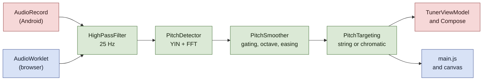

# Architecture decision records

One record per decision that would be expensive to reverse or puzzling to
inherit. Records are **append-only**: once a record is published its argument is
never rewritten, only its status changed to `Superseded by NNNN`. A later
decision that narrows an earlier one says so on its own face.

Numbering is sequential, four digits, and never reused. **Claim a number before
you write, with `.claude/scripts/fleet.sh adr-claim "<title>"`.** It allocates
against every number that exists anywhere — on any branch, in any worktree's
working tree including an uncommitted draft, and in the claims file — rather
than against what anyone remembers agreeing. Reserving by message does not
work: a reservation and the work it was meant to protect can cross, which is
how 0009 came to be claimed twice. `fleet.sh adr-taken` shows who holds what.

| # | Decision | Status |
| --- | --- | --- |
| [0001](0001-yin-with-an-fft-difference-function.md) | Detect pitch with YIN, difference function via FFT | Accepted |
| [0002](0002-gate-notes-on-ratios-not-absolute-levels.md) | Gate notes on ratios, with one absolute backstop | Accepted |
| [0003](0003-a-fading-note-is-one-still-falling.md) | A fading note is one still falling, not one below a peak | Accepted |
| [0004](0004-8192-sample-frames-at-44-1-khz.md) | 8192-sample frames, 2048 hop, 44.1 kHz | Accepted |
| [0005](0005-datastore-and-json-not-room.md) | Persist with DataStore and a JSON blob, not Room | Accepted |
| [0006](0006-layout-from-measured-window-size.md) | Lay out from measured window size, not device class | Accepted |
| [0007](0007-no-network-permission.md) | Ship with no network permission | Accepted |
| [0008](0008-verify-pitch-tracking-off-device.md) | Verify pitch tracking off-device, against real recordings | Accepted |
| [0009](0009-interfaces-for-the-seams-that-tests-need.md) | Interfaces only where a test needs a seam | Accepted |
| [0010](0010-one-tuner-core-two-platforms.md) | One tuner core, compiled for two platforms | Accepted |
| [0011](0011-a-web-tuner-alongside-the-app.md) | A web tuner alongside the app, and the privacy claim | Accepted |

## The audio path

Everything from the high-pass filter rightwards is plain Kotlin with no Android
imports, which is what lets the whole chain run under JUnit on a laptop
([0008](0008-verify-pitch-tracking-off-device.md)) and, since
[0010](0010-one-tuner-core-two-platforms.md), compile to JavaScript for the web
app as well. The green band is the shared `core` module; each platform supplies
only its own microphone and its own user interface.



`AudioEngine` is the only file under `audio/` or `model/` that imports
`android.*`. Since 0010 those packages live in `core/src/commonMain/`, where an
Android import would not compile at all, and the one file that needs them stayed
behind in the app module — so the property the records rely on is now enforced
by the build rather than by a grep. The grep still answers "is anything
Android-shaped hiding in the app module's half?":

```bash
grep -rln '^import android\.' \
  app/src/main/java/io/github/deeplow/nobstuner/audio \
  core/src/commonMain/kotlin/io/github/deeplow/nobstuner
```

It should name `AudioEngine.kt` and nothing else.

## Template

```markdown
# ADR NNNN — Title

- **Status:** Accepted
- **Date:** YYYY-MM-DD

## Context
## Decision
## Consequences
### What this costs
## Revisit when
```
