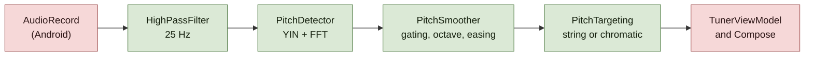

# Architecture decision records

One record per decision that would be expensive to reverse or puzzling to
inherit. Records are **append-only**: once a record is published its argument is
never rewritten, only its status changed to `Superseded by NNNN`. A later
decision that narrows an earlier one says so on its own face.

Numbering is sequential, four digits, and never reused.

| # | Decision | Status |
| --- | --- | --- |
| [0001](0001-yin-with-an-fft-difference-function.md) | Detect pitch with YIN, difference function via FFT | Accepted |
| [0002](0002-gate-notes-on-ratios-not-absolute-levels.md) | Gate notes on ratios, with one absolute backstop | Accepted |
| [0003](0003-a-fading-note-is-one-still-falling.md) | A fading note is one still falling, not one below a peak | Accepted |
| [0004](0004-8192-sample-frames-at-44-1-khz.md) | 8192-sample frames, 2048 hop, 44.1 kHz | Accepted |
| [0005](0005-datastore-and-json-not-room.md) | Persist with DataStore and a JSON blob, not Room | Accepted |
| [0006](0006-layout-from-measured-window-size.md) | Lay out from measured window size, not device class | Accepted |
| [0007](0007-no-network-permission.md) | Ship with no network permission | Accepted |
| [0008](0008-verify-pitch-tracking-off-device.md) | Verify pitch tracking off-device, against real recordings | Accepted |
| [0009](0009-interfaces-for-the-seams-that-tests-need.md) | Interfaces only where a test needs a seam | Accepted |

## The audio path

Everything from the high-pass filter rightwards is plain Kotlin with no Android
imports, which is what lets the whole chain run under JUnit on a laptop
([0008](0008-verify-pitch-tracking-off-device.md)).



`AudioEngine` is the only file under `audio/` or `model/` that imports
`android.*` — verified with
`grep -rln '^import android\.' app/src/main/java/io/github/deeplow/nobstuner/{audio,model}`.

## Template

```markdown
# ADR NNNN — Title

- **Status:** Accepted
- **Date:** YYYY-MM-DD

## Context
## Decision
## Consequences
### What this costs
## Revisit when
```
